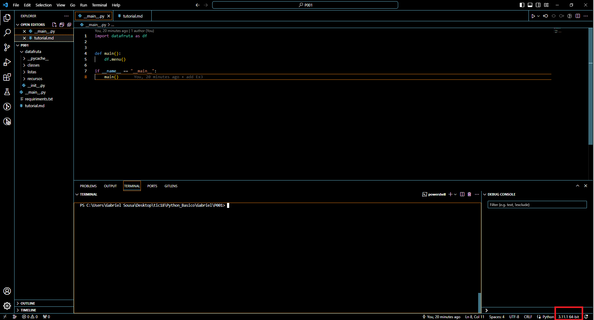
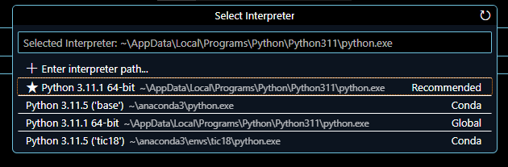
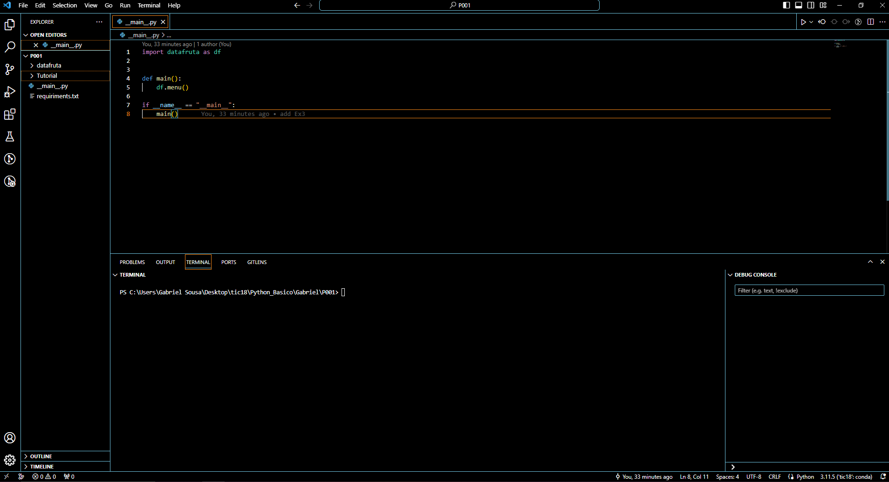

## Criando ambiente virtual conda pela interface grafica

 - Clique em "Environments", "Create"
 - Digite o nome do novo ambiente virtual
 - Selecione a versão do python e clique em "Create"

## Criando ambiente virtual conda pelo terminal

- Digite:

conda create --name "nome_do_ambiente" python="versão do python"
- Para ativar o ambiente virtual digite:
conda activate "nome_do_ambiente"
- Para desativar digite:
conda deactivate

## Utilizando ambiente virtual com o VS Code
- Clique no canto inferior direito

- Selecione o ambiente criado pelo conda

- Se o processo funcionou é possivel observar uma alteração na marcação da versão do python

## Comandos uteis
- Apresenta todos os pacotes instalados.
pip freeze

- Retornar o saida de pip freeze para um arquivo txt
pip freeze > requiriments.txt

- Instalar pacotes presentes em um arquivo requiriments
pip install -r requirements.txt

